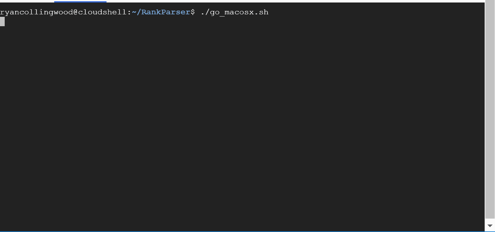
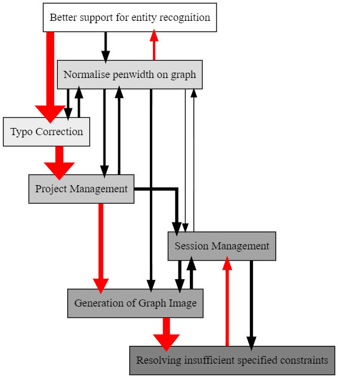

# RankParser

## Overview

From textual descriptions of People and sequence (before, after, not first) get the potential orderings.

Using `python-constraint` for defining and solving the problem, and `ply` for lexing and parsing textual descriptions.

## Syntax

See [the tutorial](resources/tutorial.md) for a detailed view of the syntax.

## Releases
See [releases](https://github.com/ryancollingwood/RankParser/releases) at present only a Windows build has been made.

## Preview in Google Cloud Shell

This will create an temporary playground in Google Cloud for you to see the application in action. 
It does require a Google Cloud account, as of August 2019 there is no charge for using Google Cloud Shell ([link](https://cloud.google.com/shell/pricing)).   

## Running

Assuming:
- Python 3.6+ installed
- `virtualenv` installed

I've created a go script for Windows and Mac. The go script will: 
- Create a virtual python environment.
- Install the requirements.
- Run the tests.
- Run the application.

### Mac and Linux:
`$ ./go_macosx.sh`

May need to `$ chmod 755 go_macosx.sh`

### Windows
`go_windows.bat`

---

## Roadmap

The following enhancements have been identified and ranked using the tool. The above image is an example of the output that can be generated by the tool.

### Better support for entity recognition
**Why?** Make it easier for humans to specify things.

**What?** At present entities with spaces are only supported between square brackets.  Future state would be to assume all words between tokens that match a token pattern make up the entity name. 

Now: `[Orange cat] before [Grey cat]`
Later: `Orange cat before Grey cat`

### Normalise penwidth on graph
**Why?** Penwidth on exported diagrams is too large, the graph is an unreadable mess of lines.

**What** When generating the graphviz export, normalise the range of penwidths between `1` and `20` (range is just an estimate). While preserving the ratio of differences.

### Typo Correction
**Why?** I can't spell to save my life.

**What?** Allowing for `[Project Management]` and `[Project Managment]` to resolve to the same thing. Perhaps with a "did you mean workflow".

### Project Management
**Why?** At the moment all querying is done in the same "space". This means you either create a mega-context or start from scratch every time.

**What?** Allow the user to state and switch between projects. Perhaps projects take the form of a directory which can store outputs and be used to regenerate state between query sessions.

### Generation of Graph Image
**Why?** Graph generation is presently limited to the creation of a graphviz textual description of a graph, which the user has to then manually turn in a diagram (https://dreampuf.github.io/GraphvizOnline/ - has been my goto).

**What?** Generate the diagram, this would require extra dependencies on the part of the environment.

### Resolving insufficient specified constraints
**Why?** When solving a diagram with few constraints the answer isn't very helpful.

**What?** When few specified constraints, prompt the user with some options perhaps using a pairwise ranking?

### Session Management
**Why?** Foundations of moving this out of a single user environment (e.g. consolse) to something more modern (e.g. Web, bots).

**What** Some form of user identification and session isolation?

