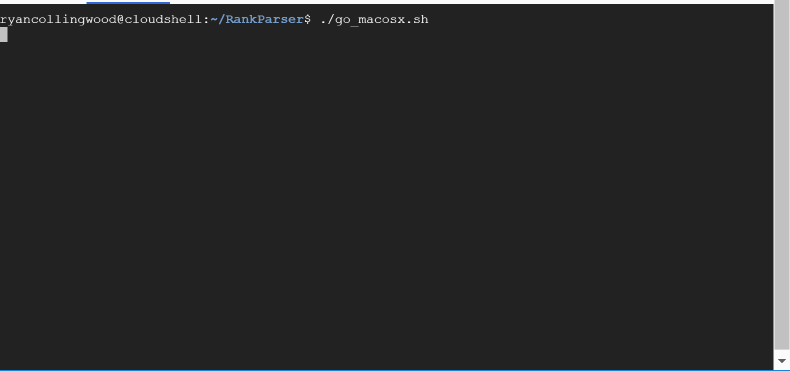
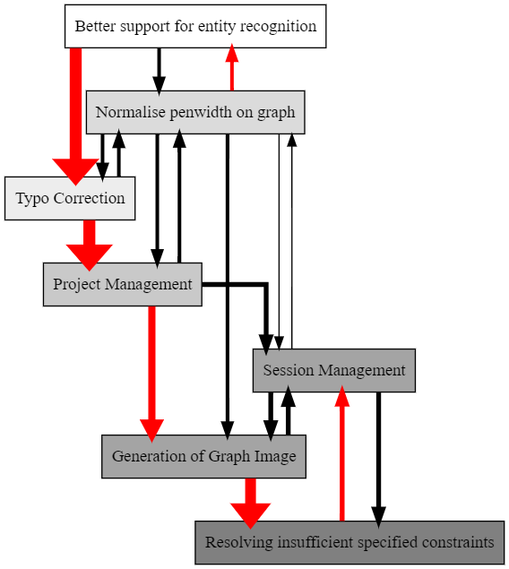

# RankParser

## Overview

From textual descriptions of People and sequence (before, after, not first) get the potential orderings.

Using `python-constraint` for defining and solving the problem, and `ply` for lexing and parsing textual descriptions.

## Syntax

See [the tutorial](resources/tutorial.md) for a detailed view of the syntax.

## Releases
See [releases](https://github.com/ryancollingwood/RankParser/releases) at present only a Windows build has been made.

## Preview in Google Cloud Shell

This will create an temporary playground in Google Cloud for you to see the application in action. 
It does require a Google Cloud account, as of August 2019 there is no charge for using Google Cloud Shell ([link](https://cloud.google.com/shell/pricing)).   

## Running

Assuming:
- Python 3.6+ installed
- `virtualenv` installed

I've created a go script for Windows and Mac. The go script will: 
- Create a virtual python environment.
- Install the requirements.
- Run the tests.
- Run the application.

### Mac and Linux:
`$ ./go_macosx.sh`

May need to `$ chmod 755 go_macosx.sh`

### Windows
`go_windows.bat`

---

## Features

### Better support for entity recognition
Entity names can be specified without square brackets in many cases (e.g., `Orange cat before Grey cat`). The parser uses token patterns to automatically extract and recognise the entity name from the statement context.

### Normalise penwidth on graph
When generating the Graphviz dot export, the edge penwidths are automatically normalised to a readable range. This preserves the proportional differences between relationship weights while preventing the output diagram from becoming an unreadable mess of lines.

### Typo Correction
Minor spelling mistakes are automatically handled using fuzzy string matching. If an entity name is misspelled (e.g., `[Project Managment]`), the solver will automatically resolve it to the closest existing entity name (e.g., `Project Management`).

### Project Management
Users can create, load, and switch between projects in the interactive console. Projects are managed as individual directories that store command history and text outputs, allowing state to be regenerated or persisted across query sessions. The interactive shell commands `load <project_name>` and `copy <project_name>` are used for this functionality.

### Resolving insufficient specified constraints
When solving a diagram with too few specified constraints, the user can type the `~` command in the interactive session. The tool will suggest a pairwise comparison to rank next based on identifying the least and most common variables to help narrow down the possible solutions.

## Roadmap

The following enhancements have been identified and ranked using the tool. The above image is an example of the output that can be generated by the tool.

### Generation of Graph Image
**Why?** Graph generation is presently limited to the creation of a graphviz textual description of a graph, which the user has to then manually turn in a diagram (https://dreampuf.github.io/GraphvizOnline/ - has been my goto).

**What?** Generate the diagram, this would require extra dependencies on the part of the environment.

### Session Management
**Why?** Foundations of moving this out of a single user environment (e.g. consolse) to something more modern (e.g. Web, bots).

**What** Some form of user identification and session isolation?

